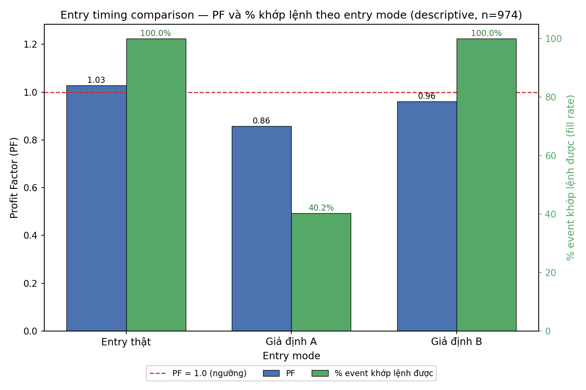

# Khảo sát mô tả Entry Timing (Task C) — 2026-09-06

**Không có dấu hiệu entry giả định nào tốt hơn đáng kể → giữ nguyên entry hiện tại.**

---

## Trả lời câu hỏi

Câu hỏi: "Entry hiện tại (open nến kế tiếp sau confirmation) có phải là điểm vào tệ không?"

Với dữ liệu, trả lời **không** — entry hiện tại không phải là điểm vào tệ so với hai phương án giả định:

| Entry mode | % event khớp lệnh được | n (trong số khớp) | PF | PF CI95 | Avg net R | Avg risk (R gốc so với entry thật) |
|---|---|---|---|---|---|---|
| **Entry thật (baseline)** | 100% | 974 | 1.03 | 0.89–1.19 | +0.014 | 1.00x (chuẩn) |
| **Giả định A (pullback)** | 40.2% | 392 | 0.86 | 0.68–1.06 | −0.094 | 0.60x |
| **Giả định B (chờ thêm 1 nến)** | 100% | 974 | 0.96 | 0.83–1.11 | −0.020 | 1.02x |

*PF/avg net R tính trên các lệnh khớp được có kết quả hợp lệ (loại các lệnh ambiguous — stop và target chạm trong cùng 1 nến, không xác định thứ tự): baseline n=973, A n=389, B n=962. n trong cột là toàn bộ số khớp được.*

**Đọc kết quả:** Cả hai entry giả định đều có PF **không vượt** baseline (A 0.86, B 0.96 so với baseline 1.03) và khoảng CI95 của cả hai đều **chứa** mức PF của baseline (baseline CI 0.89–1.19; A CI 0.68–1.06; B CI 0.83–1.11) → chênh lệch **không có ý nghĩa thống kê** và nếu có cũng **nghiêng về phía xấu đi**.

- **Giả định A (pullback)** là phương án tệ nhất: chỉ **40.2%** số event có pullback đủ 40% trong 1–2 nến sau entry (60% còn lại giá **chạy thẳng, bỏ lỡ hoàn toàn**); trên tập khớp được, PF 0.86 và avg net R −0.094 (xấu hơn baseline). Nói cách khác, các event có pullback đúng là **nhóm yếu hơn** (đà yếu), vào tại đó không cải thiện mà còn tệ hơn.
- **Giả định B (chờ thêm 1 nến)** khớp 100% nhưng PF 0.96, avg net R −0.020 — **xấu nhẹ hơn** baseline (rủi ro bình quân 1.02x so với entry thật).

Đây là một khảo sát **mô tả (descriptive)** — **KHÔNG phải bước quyết định**. Dù kết quả ra sao, **KHÔNG đổi entry logic trong Signal Engine đang chạy live** (`trading_live/live/engine/signal_engine_v2.py` **không hề bị sửa** — chỉ đọc, không ghi) dựa trên kết quả Việc C. Kết quả chỉ dùng để quyết định có đáng đầu tư thêm effort nghiên cứu hướng này hay không (câu trả lời: **không đáng**, giữ nguyên entry hiện tại).

---

## Thiết kế cố định trước khi chạy (Pre-registered criteria)

Các quy ước sau được chốt **trước khi nhìn số** và được giữ nguyên suốt quá trình (không co giãn sau khi thấy kết quả):

| # | Quy ước | Giá trị cố định |
|---|---|---|
| 1 | Bộ dữ liệu | **Frozen 974-event pool** — `pipeline_v2/data/processed/labeled_events.parquet` (974 event, 973 net-valid). *Lưu ý: file `pipeline_v2/data/labeled_events_v2.parquet` chỉ có 121 dòng — đó là tập **giảm** V2 (xem `pipeline_v2/artifacts/freeze_status_v2.0.0.md`), KHÔNG phải pool 974. Pool 974 đúng là `data/processed/labeled_events.parquet` (khớp tài liệu "frozen 974 events" trong `CHANGELOG.md` / `analysis.py`).* |
| 2 | Combo kết quả chính | reward_r = 2.0, horizon = 16 (khớp `model.target: outcome_2r_h16`, zero costs). |
| 3 | same_bar_policy | `ambiguous` (stop + target cùng nến → outcome NaN, loại khỏi PF/avg). |
| 4 | time_barrier | `mark_to_market`. |
| 5 | Chi phí | 0 (config frozen: half_spread/slippage/commission = 0). |
| 6 | Entry baseline | Open nến kế tiếp sau nến confirmation (giữ nguyên từ dataset). |
| 7 | **Entry A (pullback)** | Retracement = **40%** khoảng entry→stop (điểm giữa dải quy định 30–50%), về phía level bị sweep (đã kiểm chứng: **cả 974 event** đều có level nằm ở phía stop của entry). Khớp được nếu giá chạm mức 40% trong **1–2 nến sau entry** (nến entry và nến kế tiếp). |
| 8 | **Entry B (chờ 1 nến)** | Dịch entry sang **open nến k+2** (k+1 là nến entry thật), giữ nguyên stop logic (stop neo theo sweep extreme) và target logic (target = entry ± reward×risk). |
| 9 | Stop | Giữ **nguyên** stop thật (neo theo sweep extreme ± `stop.buffer_atr`=0.10×ATR) cho cả A và B. |
| 10 | Target | Tái tính theo target logic: `target = entry ± reward_r × risk` (risk = |entry − stop|). |

---

## Phương pháp & Mô phỏng

Với mỗi event (không đổi entry thật), mô phỏng **song song** 3 entry mode trên cùng bộ 974 event:

1. **Entry thật (baseline):** dùng chính `entry_price` / `stop_price` / `risk_price` / `target_2r` / `net_result_r` của dataset frozen.
2. **Entry A (pullback):** nếu trong 1–2 nến sau entry giá pullback đủ 40% khoảng entry→stop về phía level, giả định khớp lệnh tại mức retracement đó (limit order); stop giữ nguyên, risk/reward tái tính.
3. **Entry B (chờ thêm 1 nến):** entry = open nến k+2; stop giữ nguyên (neo theo sweep); risk = |entry_B − stop|; target = entry_B ± 2×risk.

Kết quả mỗi entry mode được tính bằng **triple-barrier walk** (nến theo nến, cập nhật MFE/MAE trước rồi kiểm tra stop/target) — đúng logic `src/labeling/triple_barrier.py`. Cách mô phỏng đã được **kiểm chứng** là tái lập chính xác `net_result_r` của dataset frozen cho **cả 974 event (0 sai lệch)** với combo (2R/h16, ambiguous, mark_to_market, cost=0), nên so sánh là nhất quán với convention của pipeline.

Trong đó "Avg net R" được tính theo **R của chính lệnh đó** (R = |entry − stop| của chính mode, đúng convention `net_result_r` của pipeline); cột "Avg risk (R gốc so với entry thật)" cho biết rủi ro (khoảng cách entry→stop) của mode đó **tính theo R của entry thật** (baseline = 1.00x chuẩn; A = 0.60x vì vào sâu hơn về phía level; B = 1.02x vì chờ 1 nến).

### Độ nhạy của A theo độ sâu pullback (mô tả thêm, không đổi kết luận)

| Độ sâu pullback | % khớp được | PF | Avg net R |
|---|---|---|---|
| 30% | 52.5% | 0.93 | −0.040 |
| 40% (chính) | 40.2% | 0.86 | −0.094 |
| 50% | 31.5% | 0.94 | −0.039 |

Ở mọi độ sâu, PF của A đều **thấp hơn** baseline (1.03) → kết luận không đổi: entry giả định không tốt hơn.

---

## Biểu đồ

`entry_timing_comparison.png` — grouped bar, trục X = 3 entry mode, **2 trục Y phụ** (PF bên trái, % khớp lệnh bên phải) để thấy rõ trade-off giữa "vào đẹp hơn" và "bỏ lỡ nhiều hơn"; có đường kẻ ngang **PF = 1.0** (ngưỡng tham chiếu, chuẩn chung mục 5).

Cùng thư mục, file số liệu chi tiết: `entry_timing_descriptive.json`.

---

## Tuân thủ & Phạm vi

- **Mô tả, không quyết định:** báo cáo này chỉ mô tả; **không train model, không tinh chỉnh tham số, không thay đổi bất kỳ logic entry nào.**
- **KHÔNG đổi live logic:** `trading_live/live/engine/signal_engine_v2.py` **để nguyên** (chỉ đọc, không ghi). Không chỉnh sửa dữ liệu frozen, config, hay code `src/`.
- **Dữ liệu:** chỉ dùng lại pool **frozen 974-event** đã freeze (không dùng lại dữ liệu đã "cháy" để tinh chỉnh gì cả, vì không có tham số nào được tinh chỉnh ở đây).
- **Nguyên tắc chung:** file có ngày (`_{YYYYMMDD}`), kết luận đậm đầu file, bảng có CI95, biểu đồ là file `.png` riêng cùng thư mục và được nhắc tên trực tiếp.

---

## Phụ lục — Nguồn & cách chạy lại

- Script: `pipeline_v2/scripts/analysis/entry_timing_descriptive.py`.
- Dữ liệu vào: `data/processed/labeled_events.parquet` (frozen 974), `data/processed/xauusd_m15.parquet` (nến).
- Chạy: `.venv/bin/python pipeline_v2/scripts/analysis/entry_timing_descriptive.py` (môi trường local `.venv` của repo hiện bị hỏng thiếu `Python3`; đã chạy bằng python3 hệ thống + pandas/numpy/pyarrow sẵn có + matplotlib 3.9.4 cài vào thư mục tạm `research/xauusd-liquidity-sweep/.dsh_pydeps`).
